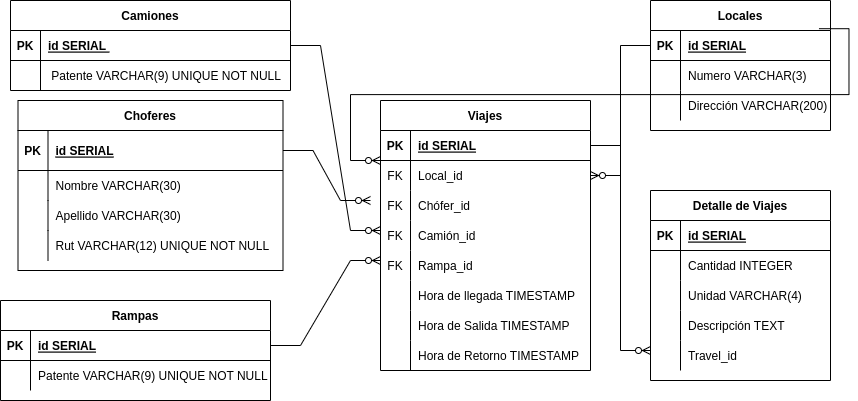

# Modelado de bases de datos relacionales.

Una empresa de transportes realiza los viajes para un gran retail y necesita una aplicación para hacer control y seguimiento de todos sus viajes. Usted participará en el diseño y construcción del modelo de bases de datos.

Luego de recorrer las instalaciones, conversar con los choferes, bodegueros y supervisores y participar de la operación por unos días llega a la conclusión de que las entidades mínimas y sus atributos son las siguientes:

- Camiones con número de patente.

- Choferes con nombre, apellido y rut.

- Rampas con número de patente.

- Viajes con local de destino, chofer ,camión, rampa, hora de salida, hora de llegada a local y hora de retorno.

- Locales con número y dirección

- Detalle de viajes con cantidad, unidad (pts, kg, box) y descripción.

Pensar muy bien las relaciones entre tablas y sus respectivas claves foráneas y primarias (PK y PF).

Usaremos una simplificación y un viaje irá a un solo local.

Entregables:

Diagrama de base de datos en draw.io con tablas, campos y relaciones.
Implementación del diagrama en el motor Postgresql. 
Scripts necesarios para crear la base de datos.
Insertar tres viajes en la bdd.

Extras:

Dump de la base de datos.

